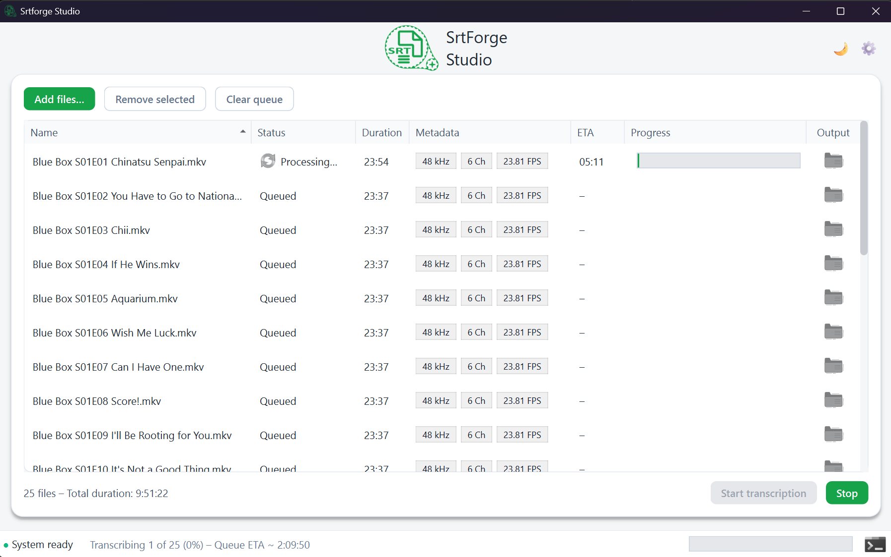

# Srtforge (Parakeet-TDT-0.6B-V2)

Srtforge is an automated subtitle-generation toolkit that turns media files
into polished `.srt` subtitles using Parakeet-TDT-0.6B-V2 + FV4 vocal
separation.

It supports:

- Single-file processing (`srtforge run`)
- Batch processing (`srtforge series`)
- Sonarr hook integration (`srtforge sonarr-hook`)
- Desktop GUI (`srtforge-gui`)

## Quick start

### Linux / WSL

```bash
git clone <your-repo> srtforge
cd srtforge
./install.sh           # auto-detects GPU, use --cpu or --gpu to override
source .venv/bin/activate
srtforge --help
```

Optional: set `HF_TOKEN=<hugging-face-token>` before install if authenticated
Hugging Face access is needed.

### Windows 11

```powershell
git clone <your-repo> srtforge
cd srtforge
./install.ps1              # auto-detect GPU
.\.venv\Scripts\Activate.ps1
srtforge --help
```

The installer supports `-Cpu`, `-Gpu`, `-PythonVersion`, and `-PythonPath`.

Installers automatically download model files into `./models`:

- `parakeet-tdt-0.6b-v2.nemo`
- `voc_fv4.ckpt`

## CLI usage

```bash
# Single media file (auto output path)
srtforge run /path/to/video.mkv

# Explicit output path
srtforge run /path/to/video.mkv --output subtitles/episode.srt

# Batch process a season directory
srtforge series "/shows/My Anime/Season 1" --glob "**/*.mkv"
```

## Windows desktop GUI

Run after activating the virtual environment:

```bash
srtforge-gui
```



GUI highlights:

- Drag and drop files anywhere in the window
- CPU/GPU device selection for the full batch
- Optional subtitle embed (soft) and burn (hard) modes
- Live logs, status toasts, and stop support

FFmpeg is auto-discovered from:

- `./ffmpeg`
- Next to the executable (PyInstaller build)
- `SRTFORGE_FFMPEG_DIR`

<details>
<summary><strong>Sonarr custom script integration</strong></summary>

1. In Sonarr, go to **Settings -> Connect** and add **Custom Script**.
2. Set **Path** to `srtforge-sonarr` (or `srtforge sonarr-hook`).
3. Leave **Arguments** empty.
4. Enable the events you want (for example: `On Import`, `On Upgrade`).

</details>

<details>
<summary><strong>Build standalone Windows executable (PyInstaller)</strong></summary>

1. Run installer once so dependencies and FFmpeg bundle are prepared.
2. Activate environment:
   ```powershell
   .\.venv\Scripts\Activate.ps1
   ```
3. Build:
   ```powershell
   pyinstaller packaging/windows/srtforge_gui.spec --noconfirm
   ```

Distribute `dist/SrtforgeGUI/` with `models/` beside `SrtforgeGUI.exe`.
Include `SrtforgeCLI.exe` too (the GUI uses it for pipeline execution).

</details>

<details>
<summary><strong>Pipeline overview</strong></summary>

1. Detect/select English audio stream
2. Extract pristine PCM audio with FFmpeg
3. Isolate vocals with FV4
4. Preprocess audio for Parakeet
5. Transcribe with Parakeet-TDT-0.6B-V2
6. Apply Netflix-style subtitle post-processing

</details>
